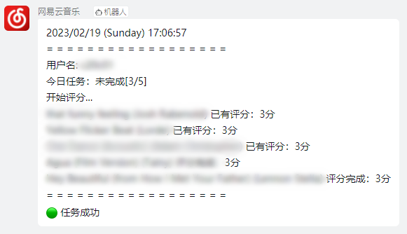

# 网易云音乐 音乐合伙人脚本

**不是“网易音乐人”的脚本呐！！！**

## 🔥 功能

[手动](#-本地手动运行)或使用[华为云函数](#-华为云函数)实现自动完成**音乐合伙人**任务。

(可选) 使用[钉钉机器人](https://open.dingtalk.com/document/robots/custom-robot-access/)返回任务完成情况。

## 📖 使用说明

### 💻 本地手动运行

1. 下载 "bot.py", "dingLog.py", "setting.json", **需放到同一文件夹内**
2. 填写"setting.json"，[参数说明](#-参数说明)
3. 直接执行"bot.py"

### ☁ [华为云函数](https://console.huaweicloud.com/functiongraph)

⚠ 请留意免费额度，以免产生不必要的支出！

1. 下载 "CloudMusicBot.zip", "Crypto_SCF_Layer_Python3.6.zip" (在"**云函数压缩包**"文件夹内)
2. 新建云函数(版本选择**Python 3.6**)，将 "CloudMusicBot.zip" 上传为函数代码
3. 将函数执行入口设为 "**bot.handler**"
4. 执行超时时间延长至60秒 (为保险起见可适当延长)
5. 填写环境变量，[参数说明](#-参数说明)
6. 将 "Crypto_SCF_Layer_Python3.6.zip" 上传为依赖包，**并在代码依赖包中添加**
7. 添加触发器，这里以每天中午12点运行一次为例：Cron表达式「0 0 12 * * ?」

### ⚙ 参数说明

| 参数名            | 说明              | 获取                                                                      |
|:---------------|:----------------|:------------------------------------------------------------------------|
| Cookie_MUSIC_U | 网易云音乐cookie     | [网易云音乐](https://music.163.com/)                                         |
| Cookie___csrf  | 网易云音乐cookie     | [网易云音乐](https://music.163.com/)                                         |
| BOT_URL        | 机器人Webhook (选填) | [机器人文档](https://open.dingtalk.com/document/robots/custom-robot-access/) |

* Cookie两周左右就会过期，请及时更新参数
* 如不使用钉钉机器人反馈结果(本地运行)，可将"BOT_URL"填写为(不包括双引号):
  * "" (将结果打印到屏幕)
  * "ignore" (不输出结果)

## 🔈 特别声明

- 本仓库发布的脚本及其中涉及的任何解锁和解密分析脚本，仅用于测试和学习研究，禁止用于商业用途，不能保证其合法性，准确性，完整性和有效性，请根据情况自行判断。

- 本项目内所有资源文件，禁止任何公众号、自媒体进行任何形式的转载、发布。

- 本人对任何脚本问题概不负责，包括但不限于由任何脚本错误导致的任何损失或损害。

- 间接使用脚本的任何用户，包括但不限于建立VPS或在某些行为违反国家/地区法律或相关法规的情况下进行传播,
  本人对于由此引起的任何隐私泄漏或其他后果概不负责。

- 请勿将本仓库的任何内容用于商业或非法目的，否则后果自负。

- 如果任何单位或个人认为该项目的脚本可能涉嫌侵犯其权利，则应及时通知并提供身份证明，所有权证明，我们将在收到认证文件后删除相关脚本。

- 任何以任何方式查看此项目的人或直接或间接使用该项目的任何脚本的使用者都应仔细阅读此声明。本人保留随时更改或补充此免责声明的权利。一旦使用并复制了任何相关脚本或Script项目的规则，则视为您已接受此免责声明。

**您必须在下载后的24小时内从计算机或手机中完全删除以上内容**

> ***您使用或者复制了本仓库且本人制作的任何脚本，则视为 `已接受` 此声明，请仔细阅读***

## 😘 鸣谢

代码参考 & "README"：https://github.com/KotoriMinami/qinglong-sign

依赖包：https://github.com/LeonX86/Music-copartner-sverless

